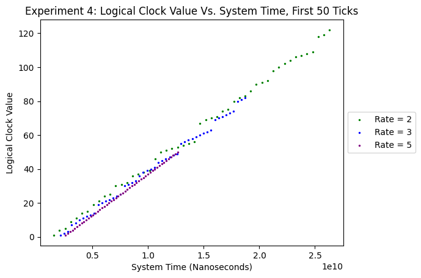
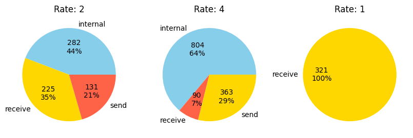

# Report of Observations

## Directions
Run the scale model at least 5 times for at least one minute each time. Examine the logs, and discuss (in the lab book) the size of the jumps in the values for the logical clocks, drift in the values of the local logical clocks in the different machines (you can get a god’s eye view because of the system time), and the impact different timings on such things as gaps in the logical clock values and length of the message queue. Observations and reflections about the model and the results of running the model are more than welcome.

## General Observations
* In machines with faster rates (e.g. 5-6), the logical clock tends to update almost consecutively, which makes sense because it is executing so fast that the majority of its logical clock progressions come from its own actions, rather than catching up to other machines.
* In machines with slower rates (e.g. 1-2), the logical clock tends to exhibit many jumps (the slower the rate relative to other machines, the larger the jumps), which makes sense because in between its slow operations, other machines are executing many operations and sending updates that it must catch up with. 
    * In addition, the majority of the time, slow machines are only receiving messages and processing those without time to send its own messages or do internal events.

## Further Variations
* We tried running the machines with a smaller variation in clock cycles by setting the random rate for a client to only take on value 1 or 2. 
    * As expected, behavior "evened out" a lot for all machines: there was a more even balance between sending messages, receiving messages, and internal events. Relatively slower machines got a chance to send some messages and have internal events, and relatively faster machines also go a chance to receive some messages.
* We tried running the machines with a smaller probability of the event being internal by setting the event random generator to only values 1-4. For 1-3, messages are sent, and now only 4 (which we expect to happen ~25% of the time) generates an internal event.
    * For fast machines (e.g. with rate 6), not much changes in its logical clock because it was already primarily updating its own clock whether thorugh send events or internal events.
    * For slower machines, however, more logical clock value jumps happen but the jumps are smaller. This is because they getting messages more often from the faster machines, and there is less clock gain in between messages.


## Data Analysis Techniques
Instead of only exmamining log.txt files, we wanted to take a closer look at how logical clock updates and clock ticks work when we concurrently run peer-to-peer interacting machines at different internal speeds. To that end, we collect .csv format data for each run and each machine. Specifically, on each run, each machine generates a dataframe, where each row represents what happens during one clock tick. The dataframe has the following columns:
* `'event_type'`: a `string` type of either `'internal'`, `'receive'`, `'send1'`, `'send2'`, or `'sendboth'`. 
* `'system_time'`: an `int` type measuring system time in nanoseconds.
* `'old_clock_time'`: `int`, the logical clock value _before_ the clock tick in question.
* `'new_clock_time'`: `int`, the new logical clock value _after_ the clock tick in question.
* `'message_queue_length'`: `int`, the message queue length _after_ the action done during this clock tick. If the event type is `'receive'`, the `'message_queue_length'` is the queue length _after_ we pop a message off of the queue.

The analysis below draws from data frames generated from five runs of the system, indexed as Experiments 4-9. (Experiment IDs 1-3 were either used for debugging or will be used for demo day.)

To see the code that generated the plots, see [analysis.ipynb](https://github.com/karlyh66/cs262assignment2/blob/main/analysis.ipynb).

## Logical Clock Value Over Time
We first examined how the logical clock value for machines of various rates grows over time, through plotting a scatterplot of logical clock value vs. system time. To best illustrate how machines of different clock rates differ, we only plot the first 50 clock ticks of each machine. This set of plots helps us see the drift of the machines in terms of the "updatedness" of each machine's logical clock relative to other machines' clocks.



We can see that, like observed in log files previously, fast machines generally update their logical clocks consecutively (in a linear relationship to system time), whereas slower machines exhibit "jumps" where they receive messages from faster ones and must catch up. We also see that in systems where machines' rates are similar, the jumps are less apparent, but in systems where there is large rate spread (e.g. 1 and 6), the slow machine must catch up in big jumps.

## Extent to which Logical Clock is Overwritten by Incoming Message
In order to examine the extent to which logical clock is overwritten by incoming messages, we look at each machine's logical clock _jump_ values from one clock tick to the next. We plotted these jumps as (1) scatterplots across system time, and (2) in histogram form (as distributions). This set of plots helps us see the drift of the machines in terms of how often (and by how much) each machine's logical clock updates are dictated by clock values of other machines

We choose experiments 4, 6, and 8 as salient examples.

Experiment 4:


The rate 2 and rate 3 machines have higher jump values than the rate 5 machine (whose jump sizes are always 1).

Experiment 6:


In the rate 6 machine, the jump values are always 1, whereas in the rate 1 machine, the jump values tend to be the highest. The rate 3 machine shows in-between behavior.

Experiment 8:


These results support our previous general observations: a slower machine's logical clock is dictated to a larger extent by faster machines' clocks than by its own logical clock---often, these slow machines "take on" the logical clock values of the faster machines.


## Length of the Message Queue Over Time
We plot message cue length (y-axis) over system time (x-axis). Experiments 6 and 8 are salient examples:

Experiment 6:


The rate 1 machine has a linearly increasing queue because the rate at which it receives messages cannot catch up to the rate at which other machines send messages to it. The rate 6 machine is always up-to-date with the message queue---it seldom gets any messages (relative to its number of clock ticks), and when it does, it can instantly pop each new message off its queue.


Experiment 8:


Notice how the rate 6 and rate 5 machines are noticeably and significantly faster at reading from its message queue than the rate 2 machine is.


The slow machines are generally most behind on their message queues, and that explains why these machines see larger gaps in logical clock values between clock ticks. 


## Frequency of Send Vs. Receive Vs. Internal Event
We also want to see which events machines of different rates tend to perform most (since the actions that a machine performs depends heavily on the length of the machine's message queue).

Slower machines: receiving much more than sending
Faster machines: pretty much sending or doing interal events most of the time, seldom receiving because it sends faster than it receives





## More on Drift: Log Files Analysis
* Logical clock time received from server: this is the clock time sent in the most recent message to this machine by another (most likely faster) machine.
* Updated logical clock value: this is the machine's logical clock value after it takes a message off the queue.

Takeaway: this machine processes messages much slower than it receives them. The most updated logical clock values are far back in the message queue of this machine.
```
Updated logical clock value to now be 418
Updated logical clock value to now be 419
Logical clock time received from server: 550
Updated logical clock value to now be 420
Logical clock time received from server: 551
Logical clock time received from server: 552
Updated logical clock value to now be 423
Updated logical clock value to now be 424
Logical clock time received from server: 563
Updated logical clock value to now be 436
Updated logical clock value to now be 437
Updated logical clock value to now be 441
Logical clock time received from server: 576
Logical clock time received from server: 570
Updated logical clock value to now be 442
Logical clock time received from server: 573
Logical clock time received from server: 585
Logical clock time received from server: 575
Updated logical clock value to now be 443
Logical clock time received from server: 577
Updated logical clock value to now be 450
Logical clock time received from server: 579
Logical clock time received from server: 592
Logical clock time received from server: 581
Updated logical clock value to now be 452
Updated logical clock value to now be 454
Logical clock time received from server: 601
```

**Machine with rate 5:**
Takeaway: this machine processes messages as quickly as it receives them. In fact, the machine's logical clock is ahead of what the incoming messages say.
```
Logical clock time received from server: 561
Updated logical clock value to now be 563
Logical clock time received from server: 563
Updated logical clock value to now be 567
Logical clock time received from server: 565
Updated logical clock value to now be 570
Logical clock time received from server: 570
Updated logical clock value to now be 578
Logical clock time received from server: 575
Updated logical clock value to now be 587
Logical clock time received from server: 578
Updated logical clock value to now be 592
Logical clock time received from server: 581
Updated logical clock value to now be 597
```